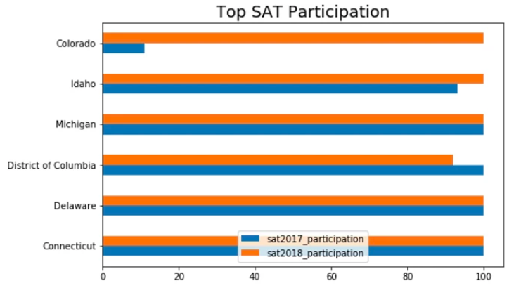
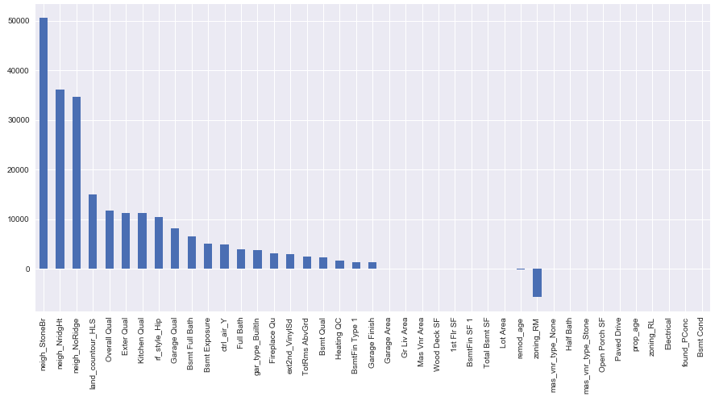
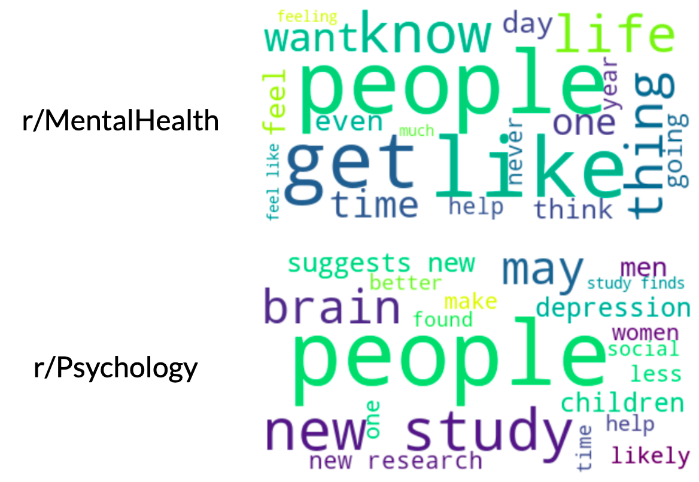
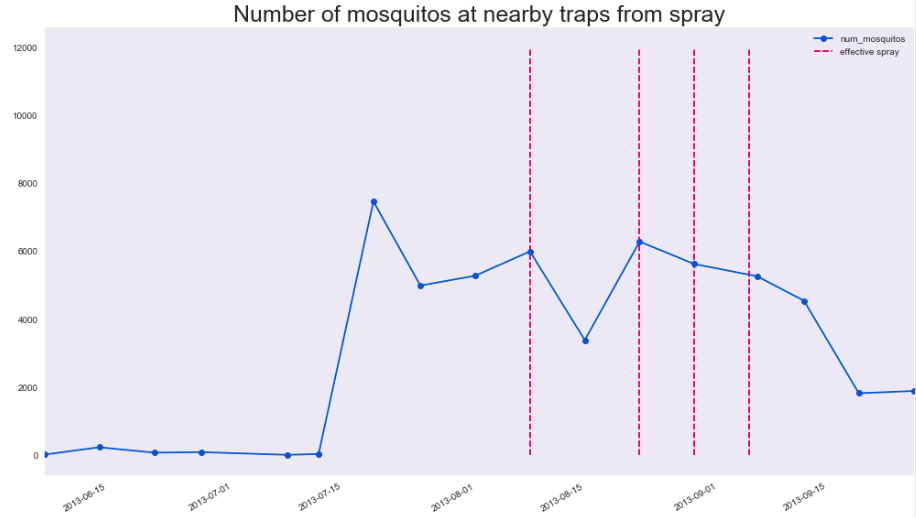
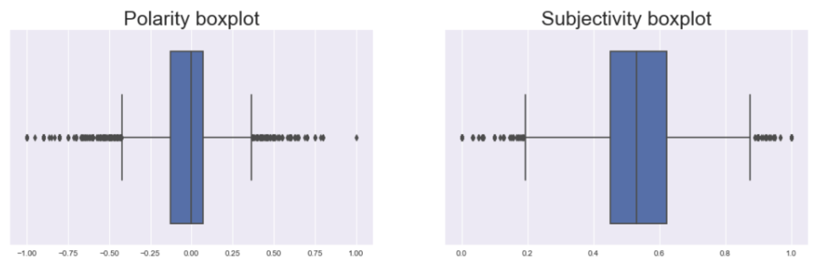

# Portfolio
---
Hello there! I'm Clement and this is a summary of the projects I have worked on and I have included their respective GitHub links for more technical details. If you're interested to know more, feel free to [get in touch](mailto:clementow.zs@gmail.com) or connect with me on [LinkedIn](https://www.linkedin.com/in/clement-ow/))!

#### Contents
- [Data Science](https://github.com/thisisclement/portfolio#data-science)

---
## Data Science

### 1. SAT and ACT scores analysis
Oct 2019 | https://github.com/thisisclement/SAT-ACT-test-score-analysis

##### Problem Statement
There are many States with their declining SAT or ACT participation rates or worse, not even moved in between years. This paper proves to see what the trends are in the SAT and ACT scores and participation rates and digs deep using statistics to find out why some of it might be the case.  Finally, conclusions were drawn and recommendations to increase SAT participation rates for a chosen state were proposed.

##### Summary of Findings
High participation rates for one test usually means low participation rates in the other, a trend that is especially true for states where one of the tests is mandatory. As such, efforts to increase participation rates for the SAT should be diverted away from states currently with mandatory ACT testings, as they may not be as effective in these states.

Based on the data examined, the data shows that by making a particular test mandatory or by offering free administration of the test, it increases the probability of the participation rate to be higher. The highest 6 States with a 100% participation rate on either years all are the result of making them mandatory or offered free.

The chosen state to increase participation rate is Iowa as it is one of the bottom two states (together with South Dakota) with the lowest participation rates for SAT tests. It seems to be the better choice with a much higher population which in turn benefits more high school students to get a chance to go to University and a relatively median household income very close to the national median to support potential tuition fees. Furthermore, more Universities are implementing a hybrid scoring approach taking into account their socio-economic status in conjunction with SAT scores for fairer University admissions.

##### The Process
- data cleaning
- exploratory data analysis of trends in scores and participation rates
- make and justify recommendations
- presentation of findings

##### Language
Python

##### Key Libraries
`pandas`, `NumPy`, `matplotlib`, `seaborn`

### 2. Ames Housing Price Prediction
Oct 2019 | https://github.com/thisisclement/Ames-Housing-Price-Prediction

  

##### Problem Statement
A comprehensive housing dataset from the city of Ames in Iowa, USA ([source](https://www.kaggle.com/c/dsi-us-6-project-2-regression-challenge/overview)) was examined. Predictors of housing prices can vary from state to state. With 70 over possible predictors, it is essential to analyse the top five predictors that can highly influence housing prices. This information can help inform buyers to look for the right kind of feature in a house or even help home owners and property companies better price them.

##### Summary of Findings
Tested 4 different regression models with various feature engineering and selection techniques. Ridge Regression came up as the best model with an R2 score of `88.82%` and does not look to be overfitted as they perform better on the test score.

Apart from the area and age of the property, the top feature that highly influences the price is a property located at Stone Brooks neighbourhood. It is no wonder the best predictor as this neighbourhood is very convenient and is the closest to Iowa State University, the largest university in Iowa state. It is also located very close to downtown. The other two neighbourhoods, Northridge Heights and Northridge are situated close together and is slightly further away to then University but is equidistant to downtown as compared to Stone Brook neighbourhood. Moreover all three neighbourhoods are very close to elementary, middle and high schools and have amenities really close by.

However, it is interesting to note that the land contour that is hilly is valued more than the other land contour features. It is perhaps has a good privacy rating among home dwellers in Ames.
At number five, Overall Quality of the property takes the spot and is no surprise that it is one of the top predictors in property prices, though the coefficient is much lower than being in the top three neighbourhoods.

It is important to note that the above conclusions are only based on the Ames housing dataset from 2006 to 2010. In order to complement the above findings, more granular data such as buyer data and coordinates of home sales would be beneficial to delve deep into analysis such as buyer behaviour or neighbourhood studies. Other factors not included in the dataset like economic conditions, buyer mindset and psychology which can influence the buyers and sellers.  

##### The Process
- deal with missing data, outliers, and skewed distributions
- engineer new features such as age sold
- model tuning and evaluations
- feature selection and identification of final model
- make and justify recommendations
- presentation of findings

##### Language
Python

##### Key Libraries
`scikit-learn`: `LinearRegression`, `Lasso`, `Ridge`, `ElasticNet`, `model_selection`

### 3. Subreddit Classification
Oct 2019 | https://github.com/thisisclement/Reddit-Classifier

  

##### Problem Statement
Assuming the production instance of Reddit went down recently which led to many posts getting stuck in the queue to be processed. Unfortunately, at the juncture when the Subreddit tag was to be tagged to the post, the system went down and thus was not able to tag the post successfully. The aim of this project is to then classify a post back into the correct Subreddit in the most accurate manner by using machine learning and Natural Language Processing (NLP) techniques. This will be a binary classification problem consisting of posts from two Subreddits, _r/MentalHealth_ and _r/Psychology_.

_r/MentalHealth_ and _r/Psychology_ were chosen because it is neither too similar nor too different. There are overlapping topics and we can see if the accuracy of the classification is indeed going to be affected.

##### Summary of Findings
Data is gathered by scrapping posts from the two popular subreddits and then training the model on 75% of the data and subsequently the other 25% as the unseen test set to evaluate the model performance. The models used will be:
- Logistic Regression
- Naive-Bayes Classifier
- Random Forest Classifier

After the training and testing phases, Logistic Regression performed the best in terms of the accuracy score. But in terms of the interpretability of the features and that it includes nearby words as well, **Naive-Bayes Classifer** is ultimately the model of choice for this classification problem. Misclassification rate is also relatively low and they are mostly due to uncontrollable factors wherein the posts that usually appears in _r/Psychology_ appeared in _r/MentalHealth_ and vice versa.

However, to truly increase the performance of the model, further research on understanding texts through linguistic features and contextualisation would need to be performed. Identifying and inputting more features into the model can also aid in increasing accuracy scores as well. Ultimately, to further tune the model we have to use an interpretable model in either Logistic Regression or Naive-Bayes Classifier to read the results to ensure it makes sense apart from just the accuracy scores.    

##### The Process
- scrape data using Reddit API and its related libraries
- clean text data (removal of html links etc.)
- text pre-processing (stemming/lemmatization)
- text tokenization
- model tuning and evaluation
- identification of final model
- presentation of findings

##### Language
Python

##### Key Libraries
`requests`, `PRAW`, `regex`, `nltk`, `scikit-learn`: `CountVectorizer`, `TfidfVectorizer`, `Pipeline`, `LogisticRegression`, `KNeighborsClassifier`, `MultinomialNB`

### 4. West Nile Virus Prediction in Chicago
Nov 2019 | https://github.com/thisisclement/West-Nile-Virus-Prediction

  

##### Problem Statement
The West Nile Virus is a single-stranded RNA virus that causes West Nile Fever, found commonly in the hotter regions of Africa, Europe, the Middle East, North America and West Asia. It is a member of the family Flaviviridae, which also contains the Zika virus, dengue virus, and yellow fever virus. Transmitted primarily by the Culex species of mosquitoes, it is maintained in nature in a cycle involving transmission between birds and mosquitoes.

This project aims to establish a model that supports the eradication of the West Nile Virus in Chicago, by detecting and suppressing the population of Culex mosquitoes in a cost effective and sustainable manner.

##### Summary of Findings
Data provided (train.csv, test.csv) was analyzed, cleaned, processed and ran through several classification models (e.g. Logistic Regression, KNearestNeighbor, Decision Tree Classifier).

The model that performed the best came from a __AdaBoost Classifier__, with a parameter of 0.73 for learning rate.

It is recommended that the city of Chicago continues its spray routine, as it is more cost effective as compared to estimated medical costs in an event of an outbreak, in order to suppress the number of Culex mosquitoes. The public should also be educated to take preventive measures to minimize the inadvertent breeding of mosquitoes.

We also recommend the following:
1. Study migratory patterns of WNV-infected birds
2. Study interactions between WNV-infected birds and Culex mosquitoes
3. Regression analysis to predict the number of Culex mosquitoes

##### The Process
As part of a group project:
- clean weather and mosquito trap data
- engineer new features such as humidity
- oversampling method (SMOTE)
- model tuning and evaluation
- cost and benefit analysis
- presentation of findings

##### Language
Python

##### Key Libraries
`imblearn`, `AdaBoostClassifier`

### 5. Online Hate Speech Prediction
Nov 2019 | https://github.com/thisisclement/Hate-Speech-Prediction

  

##### Problem Statement
In this era of the digital age, online hate speech residing in social media networks can influence hate violence or even crimes towards a certain group of people. Hate related attacks targeted at specific groups of people are at a 16-year high in the United States of America, statistics released by the FBI reported. With many social media comments posted every second, there is an immense need to eradicate hate speech as much as possible through automatic detection and prediction.

Multiple modelling approaches will be explored, such as machine learning models and even state-of-the-art deep learning models. F1 score and recall will be the metrics to be prioritised in model comparison. In the event where both are the same, actual False Negatives and False Positive numbers will be looked at.

##### Summary of Findings
Data is gathered from Reddit and Gab, a white supremacist forum. [[source]](https://github.com/jing-qian/A-Benchmark-Dataset-for-Learning-to-Intervene-in-Online-Hate-Speech) The models explored will be:

__Machine Learning models__
- Logistic Regression
- Naive-Bayes Classifier
- Ensemble models
  - Random Forest Classifier
  - Extra Trees Classifier
  - Adaboost Classifier
  - Gradient Boosting Classifier

__Deep Learning models__
- LSTM
- CNN & LSTM
- BERT model [[source]](https://github.com/google-research/bert)

| Classifier                              | F1 score | Recall |
|-----------------------------------------|----------|--------|
| Logistic Regression                     | **87.91%**   | **87.35%** |
| BERT                                    | 87%      | 87%    |

After evaluating all the models, the best model is Logistic Regression achieving an F1 score of `87.91%` and an ROC AUC score of `0.91`.

However, to truly increase the performance of the model, further research on understanding texts through linguistic features and context would need to be performed. Identifying and inputting more features into the model can also aid in increasing F1 scores as well. Ultimately, to further tune the model we have to use an interpretable model such as Logistic Regression to read the results to ensure it makes sense apart from just the accuracy scores.  

##### The Process
- text cleaning
- text pre-processing (tokenization, lemmatization, POS tagging etc. )
- word embeddings (pre-trained GloVe and Word2Vec, trained on dataset)
- model tuning and evaluation
- presentation of findings

##### Language & Tools
`Python`, `Heroku`

##### Key Libraries
`scikit-learn`, `Word2Vec`, `keras`, `ktrain`, `Flask`
